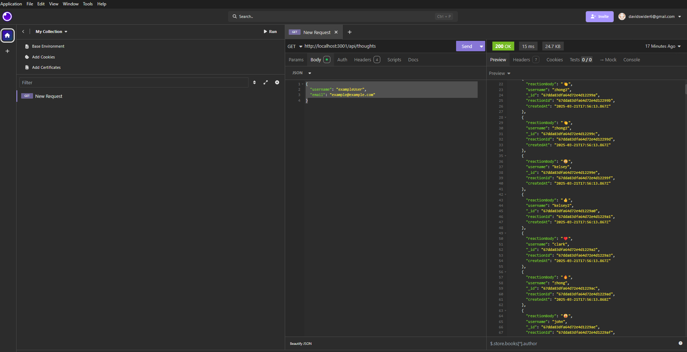

# NetworkingAPI

## Table of Contents
- [Description](#description)
- [Features](#features)
- [Technologies Used](#technologies-used)
- [Installation](#installation)
- [Usage](#usage)
- [API Routes](#api-routes)
- [Screenshots](#screenshots)
- [Watch](#watch)
- [Contact](#contact)

---

## Description
This project is a **NetworkingAPI** built using **Node.js, Express, and MongoDB**. It utilizes **Mongoose** for data modeling and allows users to create an interactive social platform. The API supports user management, thoughts (posts), reactions (comments), and friend connections.

---

## Features

### 🚀 API Functionality
- **User Management:** Create, update, delete users.
- **Thoughts:** Create, read, update, delete thoughts.
- **Reactions:** Add and remove reactions to thoughts.
- **Friend List:** Add and remove friends from a user's friend list.
- **NoSQL Database:** Uses MongoDB for scalability and efficiency.

### 🛠 Development Features
- **RESTful API** built with **Express.js**.
- **Mongoose ODM** for MongoDB interactions.
- **CRUD operations** for users, thoughts, reactions, and friends.
- **API Testing** with Insomnia or Postman.

---

## Technologies Used
- **Node.js** – Backend JavaScript runtime
- **Express.js** – Web framework for Node.js
- **MongoDB** – NoSQL database for flexible data storage
- **Mongoose** – ODM for MongoDB
- **dotenv** – Environment variable management
- **Insomnia/Postman** – API testing tools

---

## Installation
To run the project locally, follow these steps:

1. **Clone the Repository:**
   ```sh
   git clone https://github.com/DavidSwider/NetworkingAPI.git
   cd NetworkingAPI
   ```  
2. **Install Dependencies:**
   ```sh
   npm install
   ```  
3. **Set Up Environment Variables:**
   - Create a `.env` file in the root directory and add:
   ```env
   MONGO_URL='mongodb://127.0.0.1:27017/networkingDB'
   PORT=3001
   ```  
4. **Build the Server:**
   ```sh
   npm run build
   ```  
5. **Start the Server:**
   ```sh
   npm run start
   ```  
6. **Open Insomnia or Postman** to test API endpoints.

---

## Usage

1. **Start the server** using `npm start`.
2. Use **Insomnia** or **Postman** to interact with the API.
3. Perform CRUD operations:
   - Create users and thoughts.
   - Add reactions to thoughts.
   - Manage friend lists.
4. The server will sync Mongoose models to the MongoDB database automatically.

---

## API Routes

### **User Routes** (`/api/users`)
- `GET /users` → Get all users
- `GET /users/:id` → Get a user by ID
- `POST /users` → Create a new user
- `PUT /users/:id` → Update a user
- `DELETE /users/:id` → Delete a user
- `POST /users/:id/friends/:friendId` → Add a friend
- `DELETE /users/:id/friends/:friendId` → Remove a friend

### **Thought Routes** (`/api/thoughts`)
- `GET /thoughts` → Get all thoughts
- `GET /thoughts/:id` → Get a thought by ID
- `POST /thoughts` → Create a new thought
- `PUT /thoughts/:id` → Update a thought
- `DELETE /thoughts/:id` → Delete a thought
- `POST /thoughts/:id/reactions` → Add a reaction
- `DELETE /thoughts/:id/reactions/:reactionId` → Remove a reaction

---

## Screenshots
📸 **

---

## Walkthrough Video
Video Link:
🔗 **[Watch](https://drive.google.com/file/d/1rdbfddKwPUj86IniSMkNXcllFHJ5gRMH/view)**

---

## Contact
📧 Email: Davidsiwder6@gmail.com  
🔗 GitHub: [YourGitHubProfile](https://github.com/DavidSwider/NetworkingAPI)   

---

This README provides an overview of your **NetworkingAPI**. 🚀

